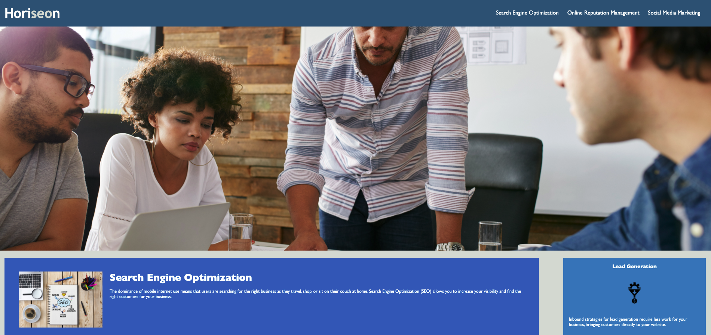
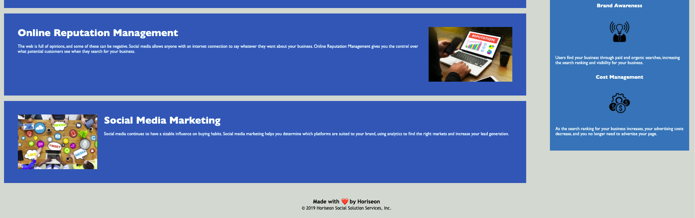

# **Horiseon HTML/CSS Optimization**

## **App URL**

https://frygit87.github.io/Horiseon-Optimization/

## **Goals**

Taking the already existing code from the Horiseon HTML and CSS and refactoring them to meet the new requirements of the user.

## **Tasks**

User requires to make web application more accessible and improve optimization, the following needed to be completed.

    ✅  Add relevant page title
    ✅  Create semantic HTML
    ✅  Add informative <alt> for images
    ✅  Connect missing ID to make NAV links operational
    ✅  Collate repative CSS selectors to DRY up the code
    ✅  Comments through CSS and HTML to explain changes

## **Web App**

